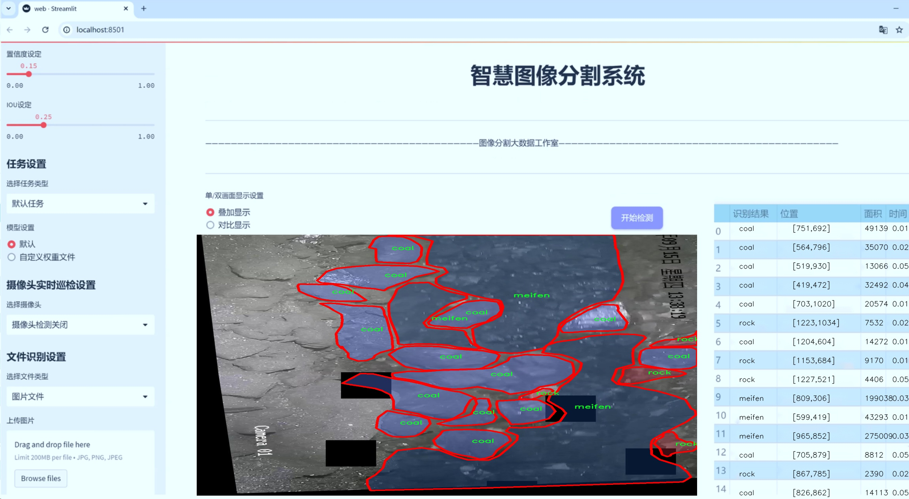
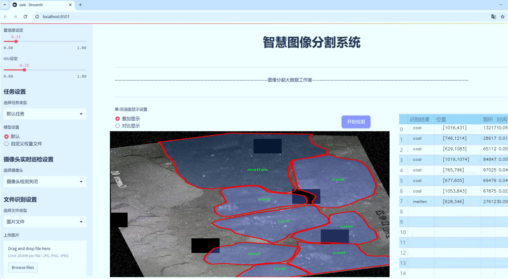
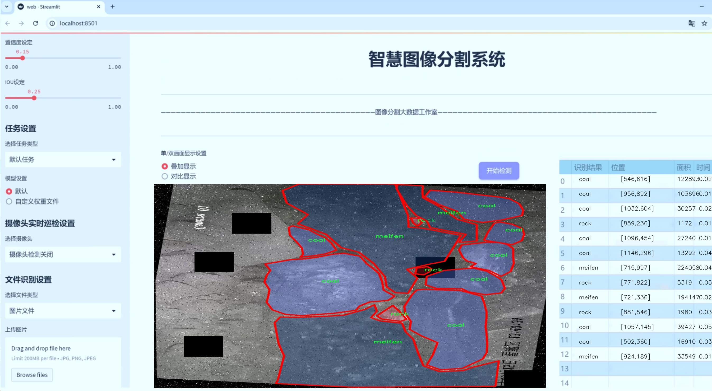
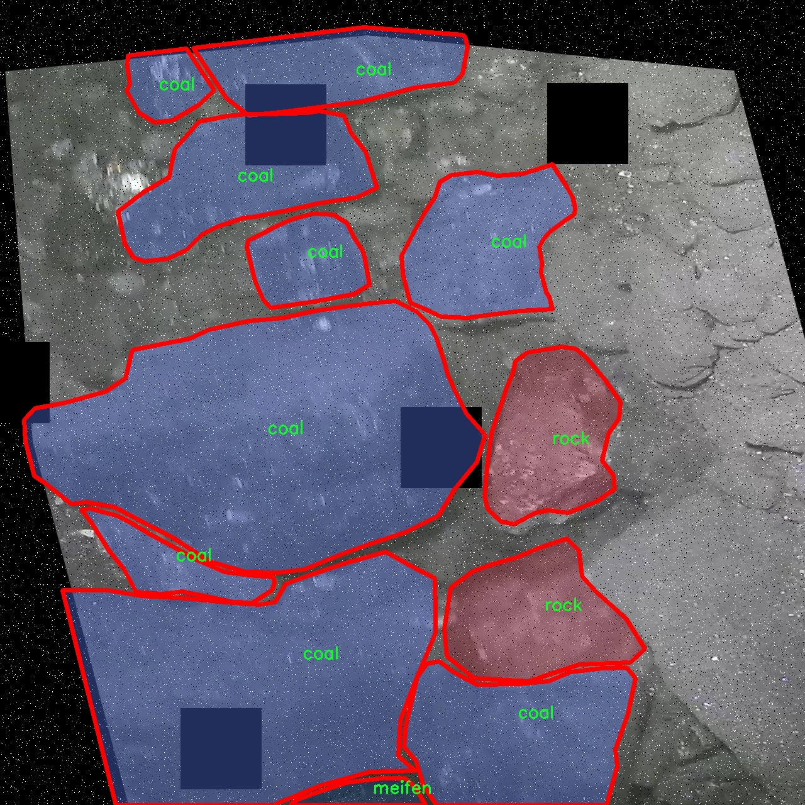
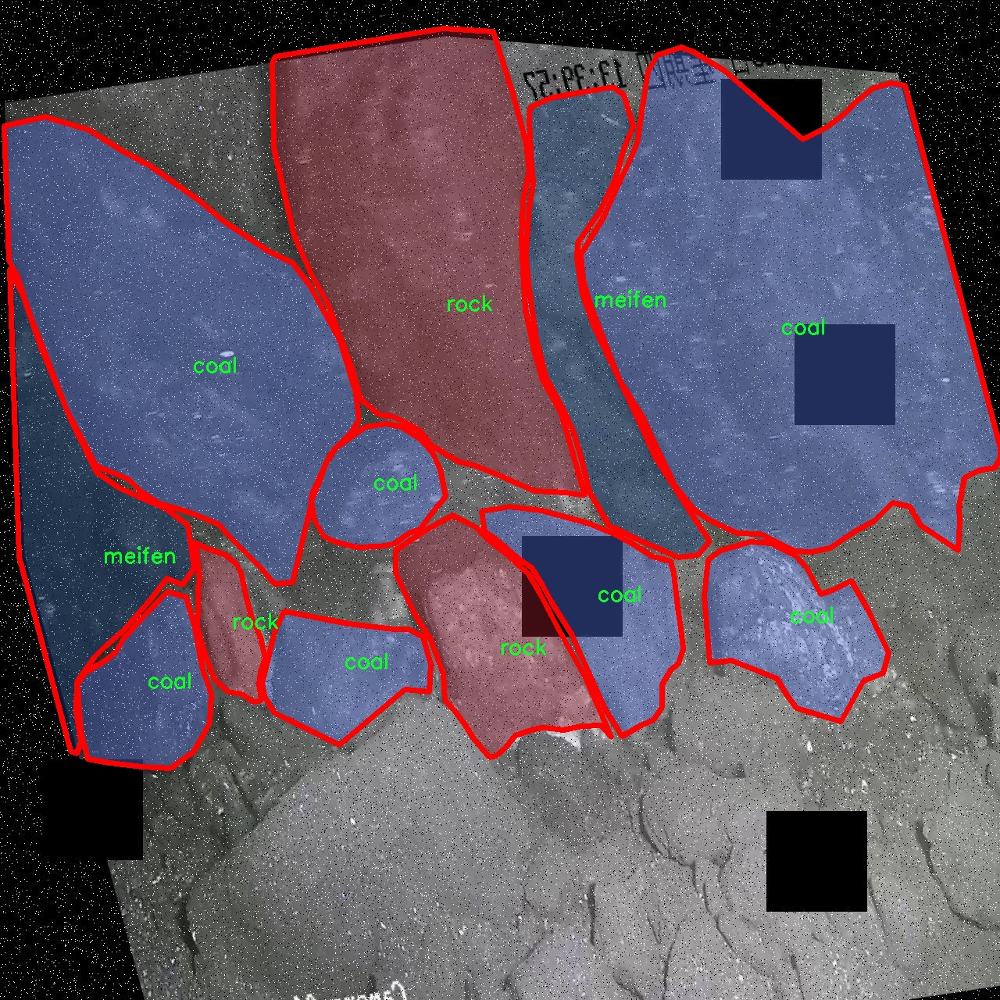
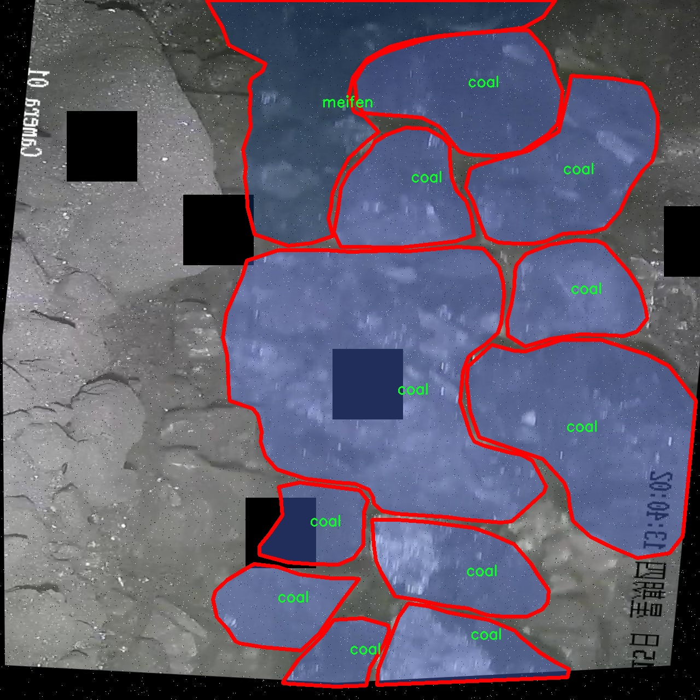
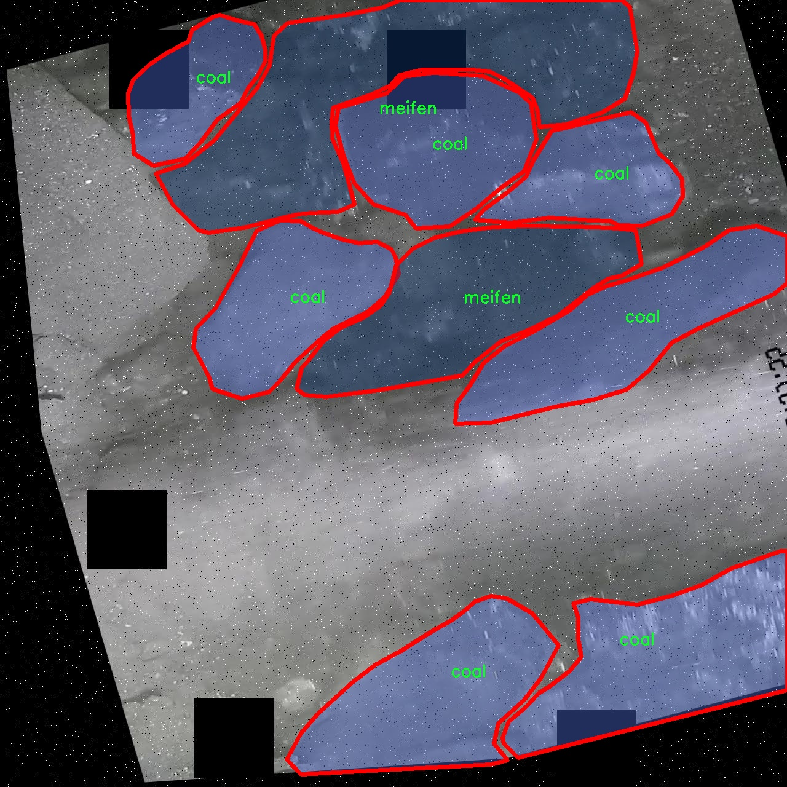
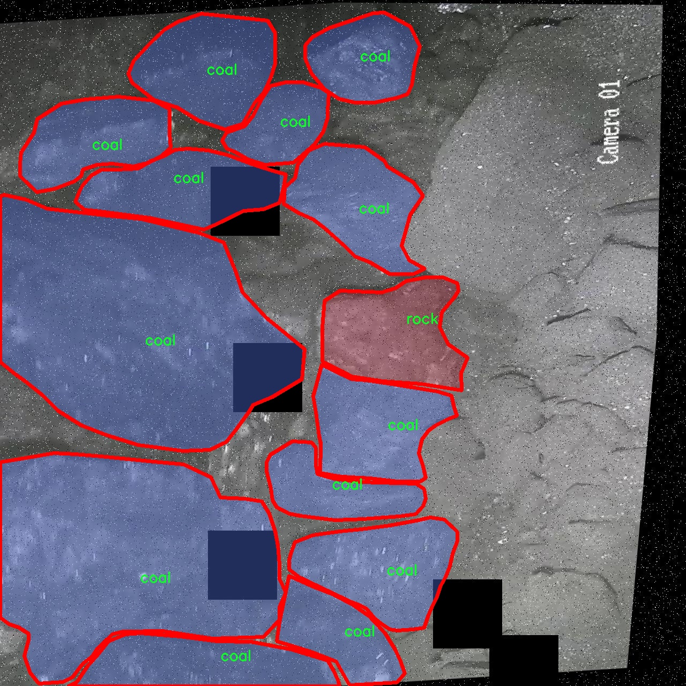

# 矿石与煤炭识别图像分割系统源码＆数据集分享
 [yolov8-seg-C2f-MSBlock＆yolov8-seg-EfficientHead等50+全套改进创新点发刊_一键训练教程_Web前端展示]

### 1.研究背景与意义

项目参考[ILSVRC ImageNet Large Scale Visual Recognition Challenge](https://gitee.com/YOLOv8_YOLOv11_Segmentation_Studio/projects)

项目来源[AAAI Global Al lnnovation Contest](https://kdocs.cn/l/cszuIiCKVNis)

研究背景与意义

随着全球经济的快速发展，矿产资源的开采与利用在推动社会进步的同时，也面临着资源枯竭和环境污染等一系列挑战。煤炭作为重要的能源之一，其开采与利用效率直接影响到能源结构的优化和可持续发展。因此，提升煤炭及矿石的识别与分类技术，对于提高资源利用率、降低环境影响具有重要的现实意义。近年来，计算机视觉技术的飞速发展，尤其是深度学习在图像处理领域的广泛应用，为矿石与煤炭的自动识别提供了新的思路和方法。

在众多深度学习模型中，YOLO（You Only Look Once）系列因其高效的实时目标检测能力而受到广泛关注。YOLOv8作为该系列的最新版本，进一步提升了检测精度和速度，尤其在复杂场景下的表现更为出色。然而，针对矿石与煤炭的具体应用场景，现有的YOLOv8模型仍存在一定的局限性，特别是在细粒度的图像分割任务中。因此，基于改进YOLOv8的矿石与煤炭识别图像分割系统的研究显得尤为重要。

本研究所使用的数据集CJT-step1-v1_3-train包含2000幅图像，涵盖了四个类别：链条、煤炭、煤粉和岩石。这些类别的选择不仅体现了矿石与煤炭在实际应用中的多样性，也为模型的训练提供了丰富的样本。通过对这些图像进行实例分割，能够有效提取出不同类别的特征信息，为后续的分类与识别奠定基础。尤其是在煤炭与矿石的自动化检测中，精确的图像分割能够显著提高识别的准确性和效率，从而为矿业生产提供强有力的技术支持。

此外，改进YOLOv8的研究还具有重要的理论意义。通过对模型架构的优化与改进，可以深入探讨深度学习在特定领域的应用潜力，推动计算机视觉技术在矿业领域的进一步发展。同时，研究过程中所积累的经验和技术，亦可为其他类似领域的图像识别与分割任务提供借鉴，具有广泛的推广价值。

综上所述，基于改进YOLOv8的矿石与煤炭识别图像分割系统的研究，不仅为提升矿业资源的自动化检测水平提供了新思路，也为推动矿业可持续发展贡献了重要力量。通过深入探讨图像分割技术在矿石与煤炭识别中的应用，将为相关领域的研究者提供新的视角与方法，促进技术的不断创新与进步。

### 2.图片演示







##### 注意：由于此博客编辑较早，上面“2.图片演示”和“3.视频演示”展示的系统图片或者视频可能为老版本，新版本在老版本的基础上升级如下：（实际效果以升级的新版本为准）

  （1）适配了YOLOV8的“目标检测”模型和“实例分割”模型，通过加载相应的权重（.pt）文件即可自适应加载模型。

  （2）支持“图片识别”、“视频识别”、“摄像头实时识别”三种识别模式。

  （3）支持“图片识别”、“视频识别”、“摄像头实时识别”三种识别结果保存导出，解决手动导出（容易卡顿出现爆内存）存在的问题，识别完自动保存结果并导出到tempDir中。

  （4）支持Web前端系统中的标题、背景图等自定义修改，后面提供修改教程。

  另外本项目提供训练的数据集和训练教程,暂不提供权重文件（best.pt）,需要您按照教程进行训练后实现图片演示和Web前端界面演示的效果。

### 3.视频演示

[3.1 视频演示](https://www.bilibili.com/video/BV1pjyHYmEsv/)

### 4.数据集信息展示

##### 4.1 本项目数据集详细数据（类别数＆类别名）

nc: 4
names: ['chain', 'coal', 'meifen', 'rock']


##### 4.2 本项目数据集信息介绍

数据集信息展示

在现代图像处理和计算机视觉领域，数据集的构建与选择对于模型的训练和性能优化至关重要。本研究所使用的数据集名为“CJT-step1-v1_3-train”，专门设计用于改进YOLOv8-seg的矿石与煤炭识别图像分割系统。该数据集的构建旨在提供高质量的图像数据，以支持模型在矿石和煤炭领域的应用，尤其是在资源勘探和环境监测等实际场景中的有效性。

“CJT-step1-v1_3-train”数据集包含四个主要类别，分别为“chain”（链条）、“coal”（煤炭）、“meifen”（煤粉）和“rock”（岩石）。这些类别的选择不仅反映了矿石与煤炭行业的实际需求，也为模型的训练提供了多样化的样本，增强了其泛化能力和识别精度。具体而言，链条类别主要用于识别与矿石开采和运输相关的设备部件，而煤炭、煤粉和岩石则是该领域的核心物料，涵盖了从原料到成品的各个环节。

在数据集的构建过程中，研究团队注重图像的多样性和代表性，以确保模型能够在不同的环境和条件下进行有效的识别。数据集中的图像不仅包括不同类型的煤炭和矿石，还涵盖了多种拍摄角度、光照条件和背景环境。这种多样性使得模型在训练过程中能够学习到更加丰富的特征，从而提升其在实际应用中的表现。

为了保证数据集的质量，所有图像均经过严格的筛选和标注。标注过程中，专业人员根据每个类别的特征，对图像中的目标进行精确的分割和标记。这一过程不仅提高了数据集的准确性，也为后续的模型训练提供了可靠的基础。经过标注的数据集将用于训练YOLOv8-seg模型，使其能够在复杂的场景中准确识别和分割出不同类别的目标。

此外，数据集的规模和结构设计也考虑到了模型训练的效率和效果。通过合理的样本数量分配，确保每个类别都有足够的训练样本，从而避免了因样本不均衡导致的模型偏差。这种精心设计的数据集将为YOLOv8-seg模型的训练提供强有力的支持，使其在矿石与煤炭的识别与分割任务中达到更高的准确率和效率。

总之，“CJT-step1-v1_3-train”数据集的构建不仅为矿石与煤炭识别提供了丰富的训练资源，也为后续的研究和应用奠定了坚实的基础。通过对该数据集的深入分析和应用，研究团队期待能够推动矿石与煤炭行业的智能化发展，为资源的高效利用和环境保护贡献力量。











### 5.全套项目环境部署视频教程（零基础手把手教学）

[5.1 环境部署教程链接（零基础手把手教学）](https://www.bilibili.com/video/BV1jG4Ve4E9t/?vd_source=bc9aec86d164b67a7004b996143742dc)


[5.2 安装Python虚拟环境创建和依赖库安装视频教程链接（零基础手把手教学）](https://www.bilibili.com/video/BV1nA4VeYEze/?vd_source=bc9aec86d164b67a7004b996143742dc)

### 6.手把手YOLOV8-seg训练视频教程（零基础小白有手就能学会）

[6.1 手把手YOLOV8-seg训练视频教程（零基础小白有手就能学会）](https://www.bilibili.com/video/BV1cA4VeYETe/?vd_source=bc9aec86d164b67a7004b996143742dc)


按照上面的训练视频教程链接加载项目提供的数据集，运行train.py即可开始训练



     Epoch   gpu_mem       box       obj       cls    labels  img_size
     1/200     0G   0.01576   0.01955  0.007536        22      1280: 100%|██████████| 849/849 [14:42<00:00,  1.04s/it]
               Class     Images     Labels          P          R     mAP@.5 mAP@.5:.95: 100%|██████████| 213/213 [01:14<00:00,  2.87it/s]
                 all       3395      17314      0.994      0.957      0.0957      0.0843

     Epoch   gpu_mem       box       obj       cls    labels  img_size
     2/200     0G   0.01578   0.01923  0.007006        22      1280: 100%|██████████| 849/849 [14:44<00:00,  1.04s/it]
               Class     Images     Labels          P          R     mAP@.5 mAP@.5:.95: 100%|██████████| 213/213 [01:12<00:00,  2.95it/s]
                 all       3395      17314      0.996      0.956      0.0957      0.0845

     Epoch   gpu_mem       box       obj       cls    labels  img_size
     3/200     0G   0.01561    0.0191  0.006895        27      1280: 100%|██████████| 849/849 [10:56<00:00,  1.29it/s]
               Class     Images     Labels          P          R     mAP@.5 mAP@.5:.95: 100%|███████   | 187/213 [00:52<00:00,  4.04it/s]
                 all       3395      17314      0.996      0.957      0.0957      0.0845


### 7.50+种全套YOLOV8-seg创新点代码加载调参视频教程（一键加载写好的改进模型的配置文件）

[7.1 50+种全套YOLOV8-seg创新点代码加载调参视频教程（一键加载写好的改进模型的配置文件）](https://www.bilibili.com/video/BV1Hw4VePEXv/?vd_source=bc9aec86d164b67a7004b996143742dc)

### 8.YOLOV8-seg图像分割算法原理

原始YOLOv8-seg算法原理

YOLOv8-seg算法是YOLO系列的最新版本，专注于目标检测与分割任务的结合，旨在提高在复杂环境下对目标的识别与定位能力。作为YOLOv8的一个扩展，YOLOv8-seg不仅继承了YOLOv8在目标检测方面的优越性能，还引入了语义分割的功能，使得模型能够对图像中的每个像素进行分类，从而实现更为精细的目标识别。这一创新使得YOLOv8-seg在处理诸如小目标、复杂背景等挑战时，展现出更强的适应性和准确性。

YOLOv8-seg的架构主要由三个核心部分组成：Backbone、Neck和Head。Backbone负责特征提取，采用了CSPDarknet结构，这一结构通过交叉阶段部分（Cross Stage Partial）设计有效地减少了计算量，同时保留了重要的特征信息。与前代模型相比，YOLOv8-seg在特征提取中引入了C2f模块，该模块通过将输入特征图分为两个分支，分别进行卷积操作，进而生成更高维度的特征图。这种分支结构的设计使得模型能够更好地捕捉到不同层次的特征信息，从而提升了特征提取的效果。

在特征提取的过程中，YOLOv8-seg还采用了快速空间金字塔池化（SPPF）结构，以便于提取不同尺度的特征。这一结构不仅有效减少了模型的参数量和计算量，还提升了特征提取的效率，使得模型在处理多尺度目标时表现得更加灵活。通过这种方式，YOLOv8-seg能够在不同的场景下保持高效的特征提取能力，从而为后续的目标检测和分割提供了坚实的基础。

在Neck部分，YOLOv8-seg使用了特征金字塔网络（FPN）和路径聚合网络（PAN）结构，旨在通过多层次的特征融合来提升模型的检测能力。通过上采样和下采样操作，Neck能够有效地整合来自不同层次的特征图，从而形成一个更为丰富的特征表示。这一过程不仅增强了模型对小目标的感知能力，还提升了对复杂背景的适应性，使得YOLOv8-seg在各种应用场景中都能保持较高的准确度。

YOLOv8-seg的Head部分则负责最终的目标检测与分割任务。与传统的锚框（Anchor-based）方法不同，YOLOv8-seg采用了无锚框（Anchor-Free）的检测方式，直接预测目标的中心点及其宽高比例。这一创新不仅减少了锚框的数量，还提高了检测速度和准确度，使得模型在实时应用中表现得更加出色。此外，YOLOv8-seg在分割任务中，通过引入解耦头（Decoupled Head）结构，实现了分类与回归过程的解耦，从而使得模型在处理目标检测与分割时能够更为高效。

在损失函数的设计上，YOLOv8-seg结合了多种损失计算方法，包括二元交叉熵（BCE）和分布焦点损失（DFL），以提高模型的分类和回归精度。通过对分类分数和回归分数的加权，YOLOv8-seg能够更好地匹配正样本，从而提升整体的检测性能。这种损失计算策略的优化，使得YOLOv8-seg在面对复杂场景时，能够更为精准地进行目标定位与分割。

总的来说，YOLOv8-seg算法在原有YOLOv8的基础上，通过引入更为先进的特征提取、特征融合及目标检测策略，显著提升了模型在复杂环境下的表现。其高效的特征提取能力和灵活的目标检测方式，使得YOLOv8-seg在智能监控、自动驾驶以及其他需要实时目标检测与分割的应用场景中，展现出强大的潜力和广泛的适用性。通过不断的技术迭代与优化，YOLOv8-seg不仅为目标检测领域带来了新的思路，也为未来的研究提供了丰富的可能性。


### 9.系统功能展示（检测对象为举例，实际内容以本项目数据集为准）

图9.1.系统支持检测结果表格显示

  图9.2.系统支持置信度和IOU阈值手动调节

  图9.3.系统支持自定义加载权重文件best.pt(需要你通过步骤5中训练获得)

  图9.4.系统支持摄像头实时识别

  图9.5.系统支持图片识别

  图9.6.系统支持视频识别

  图9.7.系统支持识别结果文件自动保存

  图9.8.系统支持Excel导出检测结果数据


### 10.50+种全套YOLOV8-seg创新点原理讲解（非科班也可以轻松写刊发刊，V11版本正在科研待更新）

#### 10.1 由于篇幅限制，每个创新点的具体原理讲解就不一一展开，具体见下列网址中的创新点对应子项目的技术原理博客网址【Blog】：


[10.1 50+种全套YOLOV8-seg创新点原理讲解链接](https://gitee.com/qunmasj/good)

#### 10.2 部分改进模块原理讲解(完整的改进原理见上图和技术博客链接)【如果此小节的图加载失败可以通过CSDN或者Github搜索该博客的标题访问原始博客，原始博客图片显示正常】
### YOLOv8简介
Yolov8主要借鉴了Yolov5、Yolov6、YoloX等模型的设计优点，其本身创新点不多，偏重在工程实践上，具体创新如下:
·提供了一个全新的SOTA模型（包括P5 640和P6 1280分辨率的目标检测网络和基于YOLACT的实例分割模型)。并且，基于缩放系数提供了N/S/M/IL/X不同尺度的模型，以满足不同部署平台和应用场景的需求。
●Backbone:同样借鉴了CSP模块思想，不过将Yolov5中的C3模块替换成了C2f模块，实现了进一步轻量化，同时沿用Yolov5中的SPPF模块，并对不同尺度的模型进行精心微调，不再是无脑式—套参数用于所有模型，大幅提升了模型性能。
●Neck:继续使用PAN的思想，但是通过对比YOLOv5与YOLOv8的结构图可以看到，YOLOv8移除了1*1降采样层。
●Head部分相比YOLOv5改动较大，Yolov8换成了目前主流的解耦头结构(Decoupled-Head)，将分类和检测头分离，同时也从Anchor-Based换成了Anchor-Free。
●Loss计算:使用VFLLoss作为分类损失(实际训练中使用BCE Loss);使用DFLLoss+ClOU Loss作为回归损失。
●标签分配: Yolov8抛弃了以往的loU分配或者单边比例的分配方式，而是采用Task-Aligned Assigner正负样本分配策略。
#### Yolov8网络结构
Yolov8模型网络结构图如下图所示。


#### Backbone
Yolov8的Backbone同样借鉴了CSPDarkNet结构网络结构，与Yolov5最大区别是，Yolov8使用C2f模块代替C3模块。具体改进如下:
·第一个卷积层的Kernel size从6×6改为3x3。
·所有的C3模块改为C2f模块，如下图所示，多了更多的跳层连接和额外Split操作。。Block数由C3模块3-6-9-3改为C2f模块的3-6-6-3。

### 上下文引导网络（CGNet）简介


高准确率的模型（蓝点），由图像分类网络转化而来且参数量大，因此大多不适于移动设备。
低分辨率的小模型（红点），遵循分类网络的设计方式，忽略了分割特性，故而效果不好。
#### CGNet的设计：
为了提升准确率，用cgnet探索语义分割的固有属性。对于准确率的提升，因为语义分割是像素级分类和目标定位，所以空间依赖性和上下文信息发挥了重要作用。因此，设计cg模块，用于建模空间依赖性和语义上下文信息。
- 1、cg模块学习局部特征和周围特征形成联合特征
- 2、通过逐通道重新加权（强调有用信息，压缩无用信息），用全局特征改善联合特征
- 3、在全阶段应用cg模块，以便从语义层和空间层捕捉信息。
为了降低参数量：1、深层窄网络，尽可能节约内存 2、用通道卷积


之前的网络根据框架可分三类：
- 1、FCN-shape的模型，遵循分类网络的设计，忽略了上下文信息 ESPNet、ENet、fcn
- 2、FCN-CM模型，在编码阶段后用上下文模块捕捉语义级信息 DPC、DenseASPP、DFN、PSPNet
- 3、（our）在整个阶段捕捉上下文特征
- 4、主流分割网络的下采样为五次，学习了很多关于物体的抽象特征，丢失了很多有鉴别性的空间信息，导致分割边界过于平滑，（our）仅采用三次下采样，利于保存空间信息


#### cg模块

Cg模块：
思路：人类视觉系统依赖上下文信息理解场景。
如图3,a， 如若仅关注黄色框框，很难分辨，也就是说，仅关注局部特征不容易正确识别目标的类别。 然后，如果加入了目标周围的特征，即图3,b，就很容易识别正确，所以周围特征对于语义分割是很有帮助的。在此基础上，如果进一步用整个场景的特征加以辅助，将会有更高的程度去争正确分类黄色框框的物体，如图3,c所示。 故，周围上下文和全局上下文对于提升分割精度都是有帮助的。


实现：基于此，提出cg模块，利用局部特征，周围上下文以及全局上下文。如图3,d所示。该模块共包含两个阶段。

第一步，floc( ) 局部和 fsur( )周围函数分别学习对应特征。floc( )用3x3卷积从周围8个点提取特征，对应于黄色框框；同时fsur( )用感受野更大的3x3带孔卷积学习周围上下文，对应红色框框。然后fjoi( )是指将前两路特征concat之后经BN，PReLU。此一部分是cg模块的第一步。
对于模块的第二步，fglo( )用于提取全局特征，改善联合特征。受SENet启发，全局上下文被认为是一个加权向量，用于逐通道微调联合特征，以强调有用元素、压缩无用元素。在本论文中，fglo( )用GAP产生聚合上下文特征，然后用多层感知机进一步提取全局上下文。最后，使用一个尺度层对联合特征重新加权用提取的全局上下文。
残差连接有利于学习更复杂的特征以及便于训练时梯度反向传播。两个拟设计方案，LRL局部残差连接和GRL全局残差连接，实验证明（消融实验），GRL效果更好

#### CGNet网络


原则：深、瘦（deep and thin）以节省内存。层数少，通道数少，三个下采样。

Stage1，三个标准卷积层，分辨率变成原来的1/2

Stage2和stage3，分别堆叠M和N个cg模块。该两个阶段，第一层的输入是前一阶段第一个和最后一个block的结合（how结合）利于特征重用和特征传播。

将输入图像下采样到1/4和1/8分别输入到第2和3阶段。

最后，用1x1卷积层进行分割预测。

为进一步降低参数量，局部和周围特征提取器采用了逐通道卷积。之前有的工作在逐通道卷积后采用1x1卷积用以改善通道间的信息流动，本文消融实验显示效果不好，分析：因为cg模块中提取的局部和全局特征需要保持通道独立性，所以本论文不使用1*1卷积。


### 11.项目核心源码讲解（再也不用担心看不懂代码逻辑）

#### 11.1 ultralytics\models\yolo\classify\val.py

以下是对给定代码的核心部分进行分析和详细注释的结果：

```python
import torch
from ultralytics.data import ClassificationDataset, build_dataloader
from ultralytics.engine.validator import BaseValidator
from ultralytics.utils import LOGGER
from ultralytics.utils.metrics import ClassifyMetrics, ConfusionMatrix
from ultralytics.utils.plotting import plot_images

class ClassificationValidator(BaseValidator):
    """
    扩展自 BaseValidator 类的分类模型验证器类。
    该类用于对分类模型进行验证。
    """

    def __init__(self, dataloader=None, save_dir=None, pbar=None, args=None, _callbacks=None):
        """初始化 ClassificationValidator 实例，设置数据加载器、保存目录、进度条和参数。"""
        super().__init__(dataloader, save_dir, pbar, args, _callbacks)
        self.targets = None  # 存储真实标签
        self.pred = None     # 存储模型预测结果
        self.args.task = 'classify'  # 设置任务类型为分类
        self.metrics = ClassifyMetrics()  # 初始化分类指标

    def init_metrics(self, model):
        """初始化混淆矩阵、类名以及 top-1 和 top-5 准确率。"""
        self.names = model.names  # 获取类名
        self.nc = len(model.names)  # 类别数量
        self.confusion_matrix = ConfusionMatrix(nc=self.nc, conf=self.args.conf, task='classify')  # 初始化混淆矩阵
        self.pred = []  # 初始化预测结果列表
        self.targets = []  # 初始化真实标签列表

    def preprocess(self, batch):
        """预处理输入批次并返回处理后的批次。"""
        batch['img'] = batch['img'].to(self.device, non_blocking=True)  # 将图像移动到设备上
        batch['img'] = batch['img'].half() if self.args.half else batch['img'].float()  # 根据参数选择数据类型
        batch['cls'] = batch['cls'].to(self.device)  # 将标签移动到设备上
        return batch

    def update_metrics(self, preds, batch):
        """使用模型预测和批次目标更新运行指标。"""
        n5 = min(len(self.names), 5)  # 取前5个预测结果
        self.pred.append(preds.argsort(1, descending=True)[:, :n5])  # 记录预测结果
        self.targets.append(batch['cls'])  # 记录真实标签

    def finalize_metrics(self, *args, **kwargs):
        """最终化模型的指标，如混淆矩阵和速度。"""
        self.confusion_matrix.process_cls_preds(self.pred, self.targets)  # 处理预测和真实标签以更新混淆矩阵
        if self.args.plots:  # 如果需要绘图
            for normalize in True, False:
                self.confusion_matrix.plot(save_dir=self.save_dir,
                                           names=self.names.values(),
                                           normalize=normalize,
                                           on_plot=self.on_plot)  # 绘制混淆矩阵
        self.metrics.speed = self.speed  # 记录速度
        self.metrics.confusion_matrix = self.confusion_matrix  # 记录混淆矩阵
        self.metrics.save_dir = self.save_dir  # 记录保存目录

    def get_stats(self):
        """返回通过处理目标和预测获得的指标字典。"""
        self.metrics.process(self.targets, self.pred)  # 处理真实标签和预测结果
        return self.metrics.results_dict  # 返回结果字典

    def build_dataset(self, img_path):
        """创建并返回一个 ClassificationDataset 实例，使用给定的图像路径和预处理参数。"""
        return ClassificationDataset(root=img_path, args=self.args, augment=False, prefix=self.args.split)

    def get_dataloader(self, dataset_path, batch_size):
        """构建并返回一个用于分类任务的数据加载器。"""
        dataset = self.build_dataset(dataset_path)  # 构建数据集
        return build_dataloader(dataset, batch_size, self.args.workers, rank=-1)  # 返回数据加载器

    def print_results(self):
        """打印 YOLO 目标检测模型的评估指标。"""
        pf = '%22s' + '%11.3g' * len(self.metrics.keys)  # 打印格式
        LOGGER.info(pf % ('all', self.metrics.top1, self.metrics.top5))  # 打印 top-1 和 top-5 准确率

    def plot_val_samples(self, batch, ni):
        """绘制验证图像样本。"""
        plot_images(
            images=batch['img'],
            batch_idx=torch.arange(len(batch['img'])),
            cls=batch['cls'].view(-1),  # 使用 .view() 而不是 .squeeze() 以适应分类模型
            fname=self.save_dir / f'val_batch{ni}_labels.jpg',
            names=self.names,
            on_plot=self.on_plot)

    def plot_predictions(self, batch, preds, ni):
        """在输入图像上绘制预测结果并保存结果。"""
        plot_images(batch['img'],
                    batch_idx=torch.arange(len(batch['img'])),
                    cls=torch.argmax(preds, dim=1),  # 获取预测的类别
                    fname=self.save_dir / f'val_batch{ni}_pred.jpg',
                    names=self.names,
                    on_plot=self.on_plot)  # 绘制预测结果
```

### 核心部分说明
1. **类的初始化**：`__init__` 方法中初始化了验证器的基本参数，包括数据加载器、保存目录、进度条和任务类型。
2. **指标初始化**：`init_metrics` 方法用于初始化混淆矩阵和其他指标。
3. **数据预处理**：`preprocess` 方法将输入数据转换为适合模型的格式。
4. **指标更新**：`update_metrics` 方法在每个批次后更新预测和真实标签。
5. **最终化指标**：`finalize_metrics` 方法处理混淆矩阵并准备绘图。
6. **结果获取**：`get_stats` 方法返回处理后的指标结果。
7. **数据集和数据加载器构建**：`build_dataset` 和 `get_dataloader` 方法用于创建数据集和数据加载器。
8. **结果打印和绘图**：`print_results`、`plot_val_samples` 和 `plot_predictions` 方法用于打印评估结果和绘制图像。

这些核心部分构成了分类验证器的主要功能，确保模型在分类任务中的有效性和准确性。

这个文件是Ultralytics YOLO框架中的一个用于分类模型验证的模块，名为`val.py`。它主要实现了一个名为`ClassificationValidator`的类，继承自`BaseValidator`，用于对分类模型进行验证和评估。

在这个类的构造函数中，初始化了一些重要的属性，包括数据加载器、保存目录、进度条、参数和回调函数。`self.targets`和`self.pred`用于存储真实标签和模型预测结果，`self.args.task`被设置为'classify'，表示这是一个分类任务。同时，`self.metrics`被初始化为`ClassifyMetrics`，用于计算分类相关的性能指标。

`get_desc`方法返回一个格式化的字符串，用于总结分类指标，包括类别、Top-1准确率和Top-5准确率。`init_metrics`方法则在模型初始化时设置混淆矩阵、类别名称和准确率的计算。

在`preprocess`方法中，对输入的批次数据进行预处理，将图像数据转移到指定的设备上，并根据参数决定数据类型（半精度或单精度）。`update_metrics`方法则用于更新模型的预测结果和真实标签，以便后续计算指标。

`finalize_metrics`方法在所有批次处理完成后调用，负责处理混淆矩阵和计算速度等指标。如果设置了绘图选项，还会生成混淆矩阵的可视化图。

`get_stats`方法返回一个字典，包含通过处理真实标签和预测结果得到的各种指标。`build_dataset`方法用于创建分类数据集的实例，而`get_dataloader`方法则根据给定的参数构建数据加载器。

`print_results`方法用于打印评估指标，格式化输出包括所有类别的Top-1和Top-5准确率。`plot_val_samples`和`plot_predictions`方法分别用于绘制验证样本和预测结果，生成的图像会保存到指定的目录中。

总体来说，这个文件实现了分类模型验证的完整流程，包括数据预处理、指标计算、结果输出和可视化等功能，为使用YOLO进行分类任务提供了便利。

#### 11.2 ultralytics\models\sam\amg.py

以下是经过简化并添加详细中文注释的核心代码部分：

```python
import torch
import numpy as np

def is_box_near_crop_edge(boxes: torch.Tensor,
                          crop_box: List[int],
                          orig_box: List[int],
                          atol: float = 20.0) -> torch.Tensor:
    """
    判断给定的边界框是否接近裁剪边缘。

    参数:
    - boxes: 需要判断的边界框，格式为 (x1, y1, x2, y2) 的张量。
    - crop_box: 当前裁剪框的边界，格式为 [x0, y0, x1, y1]。
    - orig_box: 原始图像的边界框，格式为 [x0, y0, x1, y1]。
    - atol: 允许的绝对误差，默认为 20.0。

    返回:
    - 一个布尔张量，指示每个边界框是否接近裁剪边缘。
    """
    crop_box_torch = torch.as_tensor(crop_box, dtype=torch.float, device=boxes.device)
    orig_box_torch = torch.as_tensor(orig_box, dtype=torch.float, device=boxes.device)
    boxes = uncrop_boxes_xyxy(boxes, crop_box).float()  # 将裁剪框内的边界框转换为原始坐标
    near_crop_edge = torch.isclose(boxes, crop_box_torch[None, :], atol=atol, rtol=0)  # 判断是否接近裁剪边缘
    near_image_edge = torch.isclose(boxes, orig_box_torch[None, :], atol=atol, rtol=0)  # 判断是否接近原始图像边缘
    near_crop_edge = torch.logical_and(near_crop_edge, ~near_image_edge)  # 取交集，排除接近原始图像边缘的框
    return torch.any(near_crop_edge, dim=1)  # 返回每个框是否接近裁剪边缘的布尔值

def uncrop_boxes_xyxy(boxes: torch.Tensor, crop_box: List[int]) -> torch.Tensor:
    """
    将裁剪框内的边界框转换为原始图像坐标。

    参数:
    - boxes: 裁剪框内的边界框，格式为 (x1, y1, x2, y2) 的张量。
    - crop_box: 当前裁剪框的边界，格式为 [x0, y0, x1, y1]。

    返回:
    - 转换后的边界框，格式为 (x1, y1, x2, y2) 的张量。
    """
    x0, y0, _, _ = crop_box  # 获取裁剪框的左上角坐标
    offset = torch.tensor([[x0, y0, x0, y0]], device=boxes.device)  # 计算偏移量
    if len(boxes.shape) == 3:  # 如果 boxes 有通道维度
        offset = offset.unsqueeze(1)  # 增加维度以便广播
    return boxes + offset  # 将偏移量加到边界框上

def batched_mask_to_box(masks: torch.Tensor) -> torch.Tensor:
    """
    计算掩码周围的边界框，返回格式为 (x1, y1, x2, y2)。

    参数:
    - masks: 输入掩码，格式为 CxHxW。

    返回:
    - 计算得到的边界框，格式为 Cx4。
    """
    if torch.numel(masks) == 0:  # 如果掩码为空
        return torch.zeros(*masks.shape[:-2], 4, device=masks.device)  # 返回全零的边界框

    shape = masks.shape
    h, w = shape[-2:]  # 获取掩码的高度和宽度
    masks = masks.flatten(0, -3) if len(shape) > 2 else masks.unsqueeze(0)  # 规范化形状为 CxHxW

    # 计算上下边缘
    in_height, _ = torch.max(masks, dim=-1)
    in_height_coords = in_height * torch.arange(h, device=in_height.device)[None, :]
    bottom_edges, _ = torch.max(in_height_coords, dim=-1)
    in_height_coords = in_height_coords + h * (~in_height)  # 将空区域的高度设置为最大值
    top_edges, _ = torch.min(in_height_coords, dim=-1)

    # 计算左右边缘
    in_width, _ = torch.max(masks, dim=-2)
    in_width_coords = in_width * torch.arange(w, device=in_width.device)[None, :]
    right_edges, _ = torch.max(in_width_coords, dim=-1)
    in_width_coords = in_width_coords + w * (~in_width)  # 将空区域的宽度设置为最大值
    left_edges, _ = torch.min(in_width_coords, dim=-1)

    # 处理空掩码的情况
    empty_filter = (right_edges < left_edges) | (bottom_edges < top_edges)
    out = torch.stack([left_edges, top_edges, right_edges, bottom_edges], dim=-1)
    out = out * (~empty_filter).unsqueeze(-1)  # 将空的边界框置为 [0, 0, 0, 0]

    return out.reshape(*shape[:-2], 4) if len(shape) > 2 else out[0]  # 返回到原始形状
```

### 代码核心部分说明：
1. **is_box_near_crop_edge**: 判断给定的边界框是否接近裁剪边缘。
2. **uncrop_boxes_xyxy**: 将裁剪框内的边界框转换为原始图像坐标。
3. **batched_mask_to_box**: 计算掩码周围的边界框，返回格式为 (x1, y1, x2, y2)。

以上函数是处理图像裁剪和边界框计算的核心逻辑，涉及到边界框的坐标转换和判断。

这个程序文件是一个与图像处理和计算机视觉相关的模块，主要用于处理图像中的掩膜（masks）和边界框（boxes）。文件中包含多个函数，每个函数实现特定的功能，以下是对这些函数的逐一说明。

首先，`is_box_near_crop_edge`函数用于判断给定的边界框是否接近裁剪区域的边缘。它接收边界框、裁剪框和原始框作为输入，并通过比较它们的坐标来返回一个布尔张量，指示哪些边界框接近裁剪边缘。

接下来，`batch_iterator`函数用于从输入参数中生成批次数据。它确保所有输入参数的长度相同，并根据指定的批次大小返回数据的批次生成器。

`calculate_stability_score`函数计算一组掩膜的稳定性得分。稳定性得分是通过对掩膜进行阈值处理得到的二进制掩膜之间的交并比（IoU）来计算的。

`build_point_grid`函数生成一个二维网格，网格中的点均匀分布在[0,1]x[0,1]的范围内。`build_all_layer_point_grids`函数则为所有裁剪层生成点网格，考虑到每层的缩放比例。

`generate_crop_boxes`函数生成不同大小的裁剪框，裁剪框的数量和大小根据图像的尺寸、层数和重叠比例来确定。它返回裁剪框的列表和对应的层索引。

`uncrop_boxes_xyxy`、`uncrop_points`和`uncrop_masks`函数用于将裁剪的边界框、点和掩膜恢复到原始图像的坐标系中。这些函数通过添加裁剪框的偏移量来实现坐标的转换。

`remove_small_regions`函数用于移除掩膜中小的孤立区域或孔洞。它使用OpenCV库的连通组件分析功能来处理掩膜，并根据给定的面积阈值进行过滤。

`batched_mask_to_box`函数计算掩膜周围的边界框，并返回这些框的坐标。它处理输入形状为多维的掩膜，并确保输出的形状与输入相匹配。

整体来看，这个模块的功能集中在图像的裁剪、掩膜处理和边界框计算上，适用于需要对图像进行分割和分析的计算机视觉任务。通过这些函数，用户可以高效地处理图像数据，提取出感兴趣的区域并进行后续分析。

#### 11.3 ui.py

```python
import sys
import subprocess

def run_script(script_path):
    """
    使用当前 Python 环境运行指定的脚本。

    Args:
        script_path (str): 要运行的脚本路径

    Returns:
        None
    """
    # 获取当前 Python 解释器的路径
    python_path = sys.executable

    # 构建运行命令
    command = f'"{python_path}" -m streamlit run "{script_path}"'

    # 执行命令
    result = subprocess.run(command, shell=True)
    if result.returncode != 0:
        print("脚本运行出错。")


# 实例化并运行应用
if __name__ == "__main__":
    # 指定您的脚本路径
    script_path = "web.py"  # 这里直接指定脚本路径

    # 运行脚本
    run_script(script_path)
```

### 代码注释说明：

1. **导入模块**：
   - `import sys`：导入 `sys` 模块，用于访问与 Python 解释器紧密相关的变量和函数。
   - `import subprocess`：导入 `subprocess` 模块，用于执行外部命令和与其交互。

2. **定义 `run_script` 函数**：
   - 该函数接受一个参数 `script_path`，表示要运行的 Python 脚本的路径。
   - 函数内部首先获取当前 Python 解释器的路径，以便后续使用。

3. **构建命令**：
   - 使用格式化字符串构建命令，命令格式为：`python -m streamlit run script_path`，其中 `script_path` 是要运行的脚本。

4. **执行命令**：
   - 使用 `subprocess.run` 方法执行构建的命令，`shell=True` 允许在 shell 中执行命令。
   - 检查命令执行的返回码，如果返回码不为 0，表示脚本运行出错，打印错误信息。

5. **主程序入口**：
   - `if __name__ == "__main__":` 确保只有在直接运行该脚本时才会执行以下代码。
   - 指定要运行的脚本路径为 `web.py`。
   - 调用 `run_script` 函数来运行指定的脚本。

这个程序文件的主要功能是使用当前的 Python 环境来运行一个指定的脚本，具体来说是运行一个名为 `web.py` 的脚本。程序首先导入了必要的模块，包括 `sys`、`os` 和 `subprocess`，这些模块分别用于获取系统信息、操作系统功能和执行外部命令。

在 `run_script` 函数中，首先获取当前 Python 解释器的路径，这通过 `sys.executable` 实现。接着，构建一个命令字符串，这个命令会调用 `streamlit` 模块来运行指定的脚本。`streamlit` 是一个用于构建数据应用的库，因此这里的脚本很可能是一个与数据展示或交互相关的应用。

使用 `subprocess.run` 方法来执行构建好的命令。这个方法会在一个新的进程中运行命令，并等待其完成。如果命令执行后返回的状态码不为零，表示脚本运行出错，程序会输出相应的错误信息。

在文件的最后部分，使用 `if __name__ == "__main__":` 语句来确保只有在直接运行该文件时才会执行下面的代码。这里指定了要运行的脚本路径为 `web.py`，并调用 `run_script` 函数来执行这个脚本。

总的来说，这个程序文件提供了一个简单的接口来运行一个 Streamlit 应用，确保了在当前 Python 环境中执行，并处理了可能出现的错误。

#### 11.4 ultralytics\nn\backbone\convnextv2.py

以下是代码中最核心的部分，并附上详细的中文注释：

```python
import torch
import torch.nn as nn
import torch.nn.functional as F

class LayerNorm(nn.Module):
    """ 自定义的LayerNorm层，支持两种数据格式：channels_last（默认）和channels_first。
    channels_last对应的输入形状为(batch_size, height, width, channels)，
    而channels_first对应的输入形状为(batch_size, channels, height, width)。
    """
    def __init__(self, normalized_shape, eps=1e-6, data_format="channels_last"):
        super().__init__()
        # 权重和偏置参数
        self.weight = nn.Parameter(torch.ones(normalized_shape))
        self.bias = nn.Parameter(torch.zeros(normalized_shape))
        self.eps = eps
        self.data_format = data_format
        if self.data_format not in ["channels_last", "channels_first"]:
            raise NotImplementedError 
        self.normalized_shape = (normalized_shape, )
    
    def forward(self, x):
        # 根据数据格式选择不同的归一化方式
        if self.data_format == "channels_last":
            return F.layer_norm(x, self.normalized_shape, self.weight, self.bias, self.eps)
        elif self.data_format == "channels_first":
            u = x.mean(1, keepdim=True)  # 计算均值
            s = (x - u).pow(2).mean(1, keepdim=True)  # 计算方差
            x = (x - u) / torch.sqrt(s + self.eps)  # 标准化
            x = self.weight[:, None, None] * x + self.bias[:, None, None]  # 应用权重和偏置
            return x

class Block(nn.Module):
    """ ConvNeXtV2中的基本块，包含深度可分离卷积和前馈网络。
    
    Args:
        dim (int): 输入通道数。
        drop_path (float): 随机深度率，默认值为0.0。
    """
    def __init__(self, dim, drop_path=0.):
        super().__init__()
        # 深度可分离卷积
        self.dwconv = nn.Conv2d(dim, dim, kernel_size=7, padding=3, groups=dim)
        self.norm = LayerNorm(dim, eps=1e-6)  # 归一化层
        self.pwconv1 = nn.Linear(dim, 4 * dim)  # 1x1卷积（用线性层实现）
        self.act = nn.GELU()  # 激活函数
        self.pwconv2 = nn.Linear(4 * dim, dim)  # 1x1卷积（用线性层实现）
        self.drop_path = nn.Identity() if drop_path <= 0. else DropPath(drop_path)  # 随机深度

    def forward(self, x):
        input = x  # 保存输入以便后续残差连接
        x = self.dwconv(x)  # 深度可分离卷积
        x = x.permute(0, 2, 3, 1)  # 转换维度顺序
        x = self.norm(x)  # 归一化
        x = self.pwconv1(x)  # 第一个1x1卷积
        x = self.act(x)  # 激活
        x = self.pwconv2(x)  # 第二个1x1卷积
        x = x.permute(0, 3, 1, 2)  # 恢复维度顺序

        x = input + self.drop_path(x)  # 残差连接
        return x

class ConvNeXtV2(nn.Module):
    """ ConvNeXt V2模型，包含多个阶段和块。
    
    Args:
        in_chans (int): 输入图像的通道数，默认值为3。
        num_classes (int): 分类头的类别数，默认值为1000。
        depths (tuple(int)): 每个阶段的块数，默认值为[3, 3, 9, 3]。
        dims (int): 每个阶段的特征维度，默认值为[96, 192, 384, 768]。
        drop_path_rate (float): 随机深度率，默认值为0。
    """
    def __init__(self, in_chans=3, num_classes=1000, 
                 depths=[3, 3, 9, 3], dims=[96, 192, 384, 768], 
                 drop_path_rate=0.):
        super().__init__()
        self.downsample_layers = nn.ModuleList()  # 下采样层
        # Stem层
        stem = nn.Sequential(
            nn.Conv2d(in_chans, dims[0], kernel_size=4, stride=4),
            LayerNorm(dims[0], eps=1e-6, data_format="channels_first")
        )
        self.downsample_layers.append(stem)
        # 添加下采样层
        for i in range(3):
            downsample_layer = nn.Sequential(
                    LayerNorm(dims[i], eps=1e-6, data_format="channels_first"),
                    nn.Conv2d(dims[i], dims[i+1], kernel_size=2, stride=2),
            )
            self.downsample_layers.append(downsample_layer)

        self.stages = nn.ModuleList()  # 特征分辨率阶段
        dp_rates = [x.item() for x in torch.linspace(0, drop_path_rate, sum(depths))] 
        cur = 0
        # 添加每个阶段的块
        for i in range(4):
            stage = nn.Sequential(
                *[Block(dim=dims[i], drop_path=dp_rates[cur + j]) for j in range(depths[i])]
            )
            self.stages.append(stage)
            cur += depths[i]

        self.norm = nn.LayerNorm(dims[-1], eps=1e-6)  # 最后的归一化层
        self.head = nn.Linear(dims[-1], num_classes)  # 分类头

    def forward(self, x):
        for i in range(4):
            x = self.downsample_layers[i](x)  # 下采样
            x = self.stages[i](x)  # 通过块
        return x  # 返回最后的特征图
```

### 代码核心部分说明：
1. **LayerNorm**: 自定义的层归一化，支持不同的数据格式，能够在不同的输入形状下进行归一化处理。
2. **Block**: ConvNeXtV2的基本构建块，包含深度可分离卷积、归一化、激活和前馈网络，支持残差连接。
3. **ConvNeXtV2**: 整个模型的定义，包含多个下采样层和阶段，每个阶段由多个Block组成，最终输出特征图。

这个程序文件定义了一个名为 ConvNeXt V2 的深度学习模型，主要用于图像分类任务。文件中包含了多个类和函数，具体功能如下：

首先，文件导入了必要的库，包括 PyTorch 和一些自定义的层。接着，定义了一个 `LayerNorm` 类，这个类实现了层归一化，支持两种数据格式：通道在最后（channels_last）和通道在最前（channels_first）。在 `forward` 方法中，根据输入数据的格式选择不同的归一化方式。

接下来，定义了一个 `GRN` 类，表示全局响应归一化层。该层通过计算输入的 L2 范数来调整输入的特征，使得输出的特征更加稳定。

然后，定义了一个 `Block` 类，表示 ConvNeXt V2 的基本构建块。这个块包含了深度可分离卷积、层归一化、点卷积、激活函数（GELU）和 GRN 层。`forward` 方法中，输入数据经过一系列操作后，返回最终的输出。

`ConvNeXtV2` 类是模型的核心部分，构造函数中定义了输入通道数、分类头的类别数、各个阶段的块数和特征维度等参数。模型的结构包括一个初始的卷积层和多个下采样层，以及四个特征分辨率阶段，每个阶段由多个残差块组成。模型的最后一层是一个线性层，用于分类。

此外，文件中还定义了一个 `_init_weights` 方法，用于初始化模型的权重，使用了截断正态分布和常数初始化。

`update_weight` 函数用于更新模型的权重，从预训练的权重字典中加载与当前模型结构匹配的权重。

最后，文件提供了一系列函数（如 `convnextv2_atto`、`convnextv2_femto` 等），用于创建不同规模的 ConvNeXt V2 模型。这些函数可以接受预训练权重的路径，并在创建模型时加载这些权重。

总体来说，这个文件实现了 ConvNeXt V2 模型的结构和功能，适用于图像分类任务，并提供了灵活的模型构建和权重加载机制。

#### 11.5 chinese_name_list.py

以下是代码的核心部分，并附上详细的中文注释：

```python
# -*- coding: utf-8 -*-  # 指定文件编码为UTF-8，以支持中文字符

# 创建一个字典，键为'person'，值为中文的"人"
Chinese_name = {'person': "人"}

# 从字典中提取所有值，并将其转换为列表
Label_list = list(Chinese_name.values())
```

### 注释说明：
1. `# -*- coding: utf-8 -*-`：这行代码用于指定文件的编码格式为UTF-8，以确保能够正确处理和显示中文字符。
2. `Chinese_name = {'person': "人"}`：定义一个字典`Chinese_name`，其中包含一个键值对，键为`'person'`，对应的值为中文字符`"人"`。
3. `Label_list = list(Chinese_name.values())`：使用`values()`方法从字典中提取所有的值，并将这些值转换为一个列表，赋值给`Label_list`。此时，`Label_list`将包含字典中所有的中文名称。

这个程序文件的名称是 `chinese_name_list.py`，它的主要功能是定义一个包含中文名称的字典，并从中提取出值形成一个列表。

首先，文件的第一行 `# -*- coding: utf-8 -*-` 是一个编码声明，表示这个文件使用 UTF-8 编码。这对于处理中文字符非常重要，因为 UTF-8 能够正确地表示各种语言的字符，包括中文。

接下来，定义了一个字典 `Chinese_name`，它的键是 `'person'`，对应的值是中文的“人”。这个字典可以用来存储与中文名称相关的各种信息，当前只包含一个条目。

然后，使用 `list(Chinese_name.values())` 这一行代码从字典中提取出所有的值，并将这些值转换成一个列表。由于 `Chinese_name` 字典中只有一个值“人”，因此 `Label_list` 列表将只包含这个单一的元素。

最终，程序的结果是创建了一个名为 `Label_list` 的列表，其中包含了中文名称“人”。这个列表可以用于后续的处理或显示。整体上，这段代码简单明了，主要用于中文名称的存储和提取。

#### 11.6 train.py

以下是经过简化和注释的核心代码部分：

```python
import os
import torch
import yaml
from ultralytics import YOLO  # 导入YOLO模型库

if __name__ == '__main__':  # 确保该模块被直接运行时才执行以下代码
    # 设置训练参数
    workers = 1  # 数据加载的工作进程数
    batch = 8  # 每个批次的样本数量
    device = "0" if torch.cuda.is_available() else "cpu"  # 判断是否使用GPU

    # 获取数据集配置文件的绝对路径
    data_path = abs_path(f'datasets/data/data.yaml', path_type='current')  

    # 读取YAML文件，保持原有顺序
    with open(data_path, 'r') as file:
        data = yaml.load(file, Loader=yaml.FullLoader)

    # 修改数据集中训练、验证和测试的路径
    if 'train' in data and 'val' in data and 'test' in data:
        directory_path = os.path.dirname(data_path.replace(os.sep, '/'))  # 获取目录路径
        data['train'] = directory_path + '/train'  # 更新训练集路径
        data['val'] = directory_path + '/val'      # 更新验证集路径
        data['test'] = directory_path + '/test'    # 更新测试集路径

        # 将修改后的数据写回YAML文件
        with open(data_path, 'w') as file:
            yaml.safe_dump(data, file, sort_keys=False)

    # 加载YOLO模型配置文件和预训练权重
    model = YOLO(r"C:\codeseg\codenew\50+种YOLOv8算法改进源码大全和调试加载训练教程（非必要）\改进YOLOv8模型配置文件\yolov8-seg-C2f-Faster.yaml").load("./weights/yolov8s-seg.pt")

    # 开始训练模型
    results = model.train(
        data=data_path,  # 指定训练数据的配置文件路径
        device=device,  # 使用指定的设备进行训练
        workers=workers,  # 使用的工作进程数
        imgsz=640,  # 输入图像的大小
        epochs=100,  # 训练的轮数
        batch=batch,  # 每个批次的样本数量
    )
```

### 代码注释说明：
1. **导入必要的库**：引入操作系统、PyTorch、YAML处理和YOLO模型库。
2. **主程序入口**：使用`if __name__ == '__main__':`确保代码仅在直接运行时执行。
3. **设置训练参数**：定义数据加载的工作进程数、批次大小和设备类型（GPU或CPU）。
4. **获取数据集配置文件路径**：使用`abs_path`函数获取数据集配置文件的绝对路径。
5. **读取和修改YAML文件**：读取YAML文件内容，更新训练、验证和测试数据的路径，并将修改后的内容写回文件。
6. **加载YOLO模型**：指定模型配置文件和预训练权重，加载YOLO模型。
7. **训练模型**：调用`model.train`方法开始训练，传入数据路径、设备、工作进程数、图像大小、训练轮数和批次大小等参数。

该程序文件 `train.py` 是一个用于训练 YOLO（You Only Look Once）模型的脚本。首先，程序导入了必要的库，包括 `os`、`torch`、`yaml` 和 `ultralytics` 中的 YOLO 模型。程序还设置了 matplotlib 的后端为 TkAgg，以便于可视化。

在 `__main__` 块中，程序首先定义了一些参数，包括工作进程数 `workers`、批次大小 `batch` 和设备类型 `device`。设备类型根据是否有可用的 GPU 进行设置，如果有则使用 GPU（设备编号为 "0"），否则使用 CPU。

接下来，程序通过 `abs_path` 函数获取数据集配置文件 `data.yaml` 的绝对路径，并将路径中的分隔符统一为 Unix 风格的斜杠。然后，程序提取该路径的目录部分，以便后续修改 YAML 文件中的路径。

程序打开 `data.yaml` 文件并读取其内容，使用 `yaml.load` 方法保持原有顺序。随后，程序检查 YAML 文件中是否包含 `train`、`val` 和 `test` 项，如果存在，则将这些项的路径修改为相对于目录的路径，并将修改后的内容写回 YAML 文件中。

在加载模型的部分，程序使用指定的配置文件 `yolov8-seg-C2f-Faster.yaml` 创建 YOLO 模型实例，并加载预训练的权重文件 `yolov8s-seg.pt`。需要注意的是，程序中提到不同模型对设备的要求不同，如果遇到显存不足的错误，可以尝试使用其他模型配置文件。

最后，程序调用 `model.train` 方法开始训练模型，传入的数据配置文件路径、设备、工作进程数、输入图像大小（640x640）、训练的 epoch 数（100）以及批次大小（8）等参数。这一过程将启动模型的训练过程。

### 12.系统整体结构（节选）

### 整体功能和构架概括

该项目主要围绕计算机视觉任务，特别是基于 YOLO（You Only Look Once）模型的目标检测和分类展开。项目中包含多个模块和文件，分别负责模型的训练、验证、推理、数据处理和增强等功能。以下是对各个文件的功能和结构的概括：

- **模型训练和验证**：通过 `train.py` 文件进行模型的训练，`val.py` 文件用于验证分类模型的性能。
- **模型定义**：`convnextv2.py` 文件定义了 ConvNeXt V2 模型结构，`block.py` 和 `attention.py` 文件则定义了模型的基本构建块和注意力机制。
- **数据处理**：`amg.py` 文件处理图像掩膜和边界框，`augment.py` 文件实现数据增强功能，`chinese_name_list.py` 文件提供中文名称的列表。
- **推理和应用**：`predictor.py` 文件用于模型的推理，`object_counter.py` 文件实现了目标计数的功能。
- **用户界面**：`ui.py` 文件提供了一个简单的用户界面来运行相关的应用。

### 文件功能整理表

| 文件路径                                          | 功能描述                                       |
|--------------------------------------------------|------------------------------------------------|
| `ultralytics/models/yolo/classify/val.py`       | 实现分类模型的验证，计算性能指标并可视化结果。 |
| `ultralytics/models/sam/amg.py`                 | 处理图像掩膜和边界框，提供裁剪和恢复功能。     |
| `ui.py`                                          | 提供用户界面以运行指定的 Streamlit 应用。      |
| `ultralytics/nn/backbone/convnextv2.py`        | 定义 ConvNeXt V2 模型结构及其组件。            |
| `chinese_name_list.py`                           | 定义一个包含中文名称的字典并提取值为列表。     |
| `train.py`                                       | 负责训练 YOLO 模型，加载数据和配置。           |
| `ultralytics/nn/modules/block.py`               | 定义模型的基本构建块，包含卷积和激活层。       |
| `ultralytics/nn/extra_modules/ops_dcnv3/test.py` | 测试 DCNv3 操作的功能，通常用于验证模型。      |
| `ultralytics/models/fastsam/model.py`           | 定义 FastSAM 模型的结构和推理过程。            |
| `ultralytics/solutions/object_counter.py`        | 实现目标计数功能，基于检测模型进行计数。       |
| `ultralytics/data/augment.py`                   | 实现数据增强功能，提升模型的泛化能力。        |
| `ultralytics/nn/extra_modules/attention.py`     | 定义注意力机制模块，用于增强模型性能。         |
| `ultralytics/engine/predictor.py`               | 负责模型的推理过程，处理输入并输出结果。       |

这个表格总结了每个文件的主要功能，帮助理解项目的整体结构和各个模块之间的关系。

注意：由于此博客编辑较早，上面“11.项目核心源码讲解（再也不用担心看不懂代码逻辑）”中部分代码可能会优化升级，仅供参考学习，完整“训练源码”、“Web前端界面”和“50+种创新点源码”以“14.完整训练+Web前端界面+50+种创新点源码、数据集获取”的内容为准。

### 13.图片、视频、摄像头图像分割Demo(去除WebUI)代码

在这个博客小节中，我们将讨论如何在不使用WebUI的情况下，实现图像分割模型的使用。本项目代码已经优化整合，方便用户将分割功能嵌入自己的项目中。
核心功能包括图片、视频、摄像头图像的分割，ROI区域的轮廓提取、类别分类、周长计算、面积计算、圆度计算以及颜色提取等。
这些功能提供了良好的二次开发基础。

### 核心代码解读

以下是主要代码片段，我们会为每一块代码进行详细的批注解释：

```python
import random
import cv2
import numpy as np
from PIL import ImageFont, ImageDraw, Image
from hashlib import md5
from model import Web_Detector
from chinese_name_list import Label_list

# 根据名称生成颜色
def generate_color_based_on_name(name):
    ......

# 计算多边形面积
def calculate_polygon_area(points):
    return cv2.contourArea(points.astype(np.float32))

...
# 绘制中文标签
def draw_with_chinese(image, text, position, font_size=20, color=(255, 0, 0)):
    image_pil = Image.fromarray(cv2.cvtColor(image, cv2.COLOR_BGR2RGB))
    draw = ImageDraw.Draw(image_pil)
    font = ImageFont.truetype("simsun.ttc", font_size, encoding="unic")
    draw.text(position, text, font=font, fill=color)
    return cv2.cvtColor(np.array(image_pil), cv2.COLOR_RGB2BGR)

# 动态调整参数
def adjust_parameter(image_size, base_size=1000):
    max_size = max(image_size)
    return max_size / base_size

# 绘制检测结果
def draw_detections(image, info, alpha=0.2):
    name, bbox, conf, cls_id, mask = info['class_name'], info['bbox'], info['score'], info['class_id'], info['mask']
    adjust_param = adjust_parameter(image.shape[:2])
    spacing = int(20 * adjust_param)

    if mask is None:
        x1, y1, x2, y2 = bbox
        aim_frame_area = (x2 - x1) * (y2 - y1)
        cv2.rectangle(image, (x1, y1), (x2, y2), color=(0, 0, 255), thickness=int(3 * adjust_param))
        image = draw_with_chinese(image, name, (x1, y1 - int(30 * adjust_param)), font_size=int(35 * adjust_param))
        y_offset = int(50 * adjust_param)  # 类别名称上方绘制，其下方留出空间
    else:
        mask_points = np.concatenate(mask)
        aim_frame_area = calculate_polygon_area(mask_points)
        mask_color = generate_color_based_on_name(name)
        try:
            overlay = image.copy()
            cv2.fillPoly(overlay, [mask_points.astype(np.int32)], mask_color)
            image = cv2.addWeighted(overlay, 0.3, image, 0.7, 0)
            cv2.drawContours(image, [mask_points.astype(np.int32)], -1, (0, 0, 255), thickness=int(8 * adjust_param))

            # 计算面积、周长、圆度
            area = cv2.contourArea(mask_points.astype(np.int32))
            perimeter = cv2.arcLength(mask_points.astype(np.int32), True)
            ......

            # 计算色彩
            mask = np.zeros(image.shape[:2], dtype=np.uint8)
            cv2.drawContours(mask, [mask_points.astype(np.int32)], -1, 255, -1)
            color_points = cv2.findNonZero(mask)
            ......

            # 绘制类别名称
            x, y = np.min(mask_points, axis=0).astype(int)
            image = draw_with_chinese(image, name, (x, y - int(30 * adjust_param)), font_size=int(35 * adjust_param))
            y_offset = int(50 * adjust_param)

            # 绘制面积、周长、圆度和色彩值
            metrics = [("Area", area), ("Perimeter", perimeter), ("Circularity", circularity), ("Color", color_str)]
            for idx, (metric_name, metric_value) in enumerate(metrics):
                ......

    return image, aim_frame_area

# 处理每帧图像
def process_frame(model, image):
    pre_img = model.preprocess(image)
    pred = model.predict(pre_img)
    det = pred[0] if det is not None and len(det)
    if det:
        det_info = model.postprocess(pred)
        for info in det_info:
            image, _ = draw_detections(image, info)
    return image

if __name__ == "__main__":
    cls_name = Label_list
    model = Web_Detector()
    model.load_model("./weights/yolov8s-seg.pt")

    # 摄像头实时处理
    cap = cv2.VideoCapture(0)
    while cap.isOpened():
        ret, frame = cap.read()
        if not ret:
            break
        ......

    # 图片处理
    image_path = './icon/OIP.jpg'
    image = cv2.imread(image_path)
    if image is not None:
        processed_image = process_frame(model, image)
        ......

    # 视频处理
    video_path = ''  # 输入视频的路径
    cap = cv2.VideoCapture(video_path)
    while cap.isOpened():
        ret, frame = cap.read()
        ......
```


### 14.完整训练+Web前端界面+50+种创新点源码、数据集获取


# [下载链接：https://mbd.pub/o/bread/Zp2bk51s](https://mbd.pub/o/bread/Zp2bk51s)